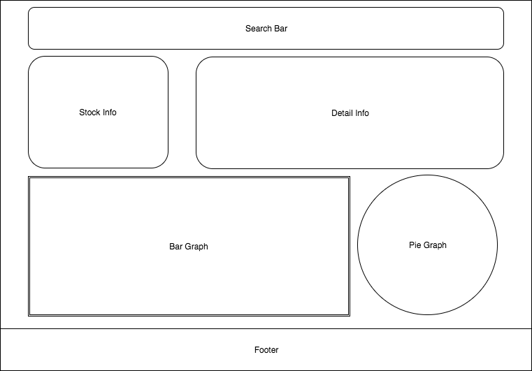

# Stock - The most current and visual pleasing equity application.

## Background, Overview, Goals
Stock is an aesthetically pleasing and informative web application which is backed with current and historical data of equity. Thoroughly implementing D3's data visualization.

User will be able to search companies and time frames of a particular stock.

## Functionality & MVP
In Stock, users are able to:
  - Search for a stock by name and/or timeframe
  - Real time update of stock
  - Multiple data visualization graphs
  - Dynamic dataset changes shown on graphs

In addition, this project will include:
  - An about modal describing base functionality

## Wireframes

## Architecture and Technologies
This project will be implemented with the following technologies:
  - `Vanilla Javascript` for overall structure and logic
  - `Jquery` only for Ajax calls
  - `D3.js` for data visualization
  - `Alpha Vantage API` for stock data
  - `Webpack` to bundle and serve the various scripts

In addition to webpack's entry file `bundle.js` there will be:
  - `alphaUtilAPI.js`: this script will handle the ajax calls to Alpha Vantage for their stock data.

  - `searchAPIUtil.js`: this script will make the ajax calls regarding different params.

  - `graph.js`: this script will be the model to create a graph and store the dataset.

  - `events.js`: this script will hold all the event listeners when it comes to listening to data change.

## Implementation Timeline
** Over The Weekend **
  - Learn D3
  - Test Alpha Vantage

** Day 1 ** : Setup all necessary Node modules, including getting `webpack` up and running. Create `webpack.config.js` as well as `package.json`. Write a entry file and the bare bones of all scripts outlined above. Learn the basics of `Alpha Vantage API`.
  - Get webpack serving and frame out index.html
  - Learn `Alpha Vantage API` and connect with AJAX.
  - Finish `alphaUtilAPI.js`

** Day 2 ** : Dedicate majority of the time to rendering the dataset into the graphs.
  - Finish `graph.js`
  - Incorporate D3 to add visualization

** Day 3 ** : Handle search criterias of stock names and date ranges.
  - Try to work and finish `searchAPIUtil.js`
  - Update page when search is finished

** Day 4 ** : Add constant updates of stock to show real time changes of equity information. Implement a beautiful UI.
  - Finish `events.js` have it do continual updates of stock info.
  - Style buttons, graphs, and page.

## Bonus features
  - Add more event handlers to make it more visually pleasing.
